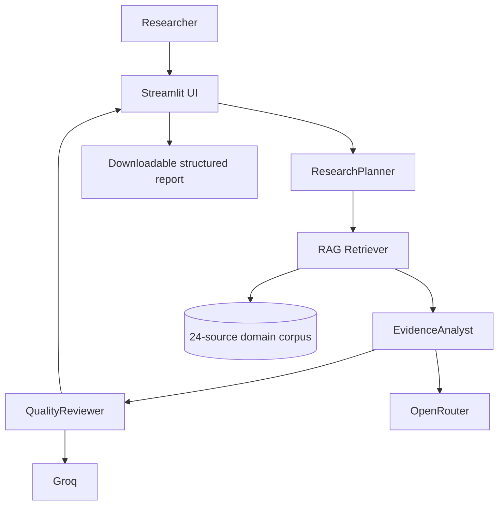
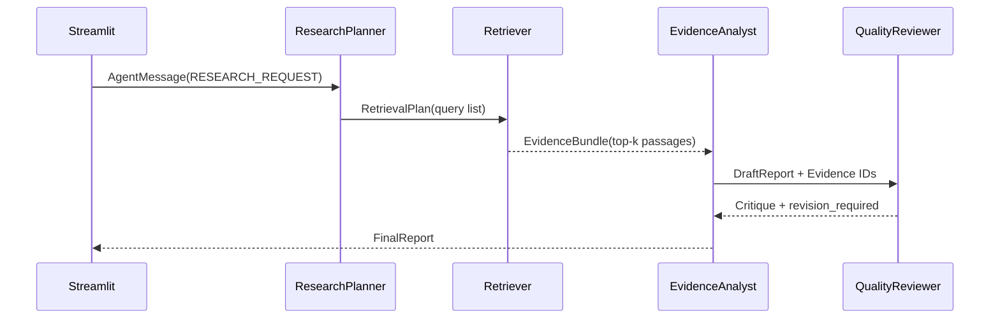

# Paddy Research Agent — Agentic AI Research Support Tool

## Project
**Research domain:** Lightweight CNNs vs Hybrid Vision Transformers for Paddy Disease Detection on Edge Devices in South Asian Agriculture.

This project implements **Option B — Research Support Tool**. It does not claim to be the final disease classifier from the research proposal. Instead, it supports the research workflow by retrieving domain evidence, planning literature analysis, extracting structured model information, comparing evidence, and reviewing the generated answer.

## Assignment requirements covered

- **3 agentic patterns:** planner/executor, tool-using RAG agent, reflection/critic loop.
- **2+ agents:** ResearchPlanner, EvidenceAnalyst, QualityReviewer.
- **Structured communication:** Pydantic `AgentMessage` objects are passed between agents.
- **2 model providers/models:** OpenRouter and Groq are supported, with different model assignments.
- **RAG:** 24 domain-specific source cards in `corpus/`, retrieved with TF-IDF cosine similarity.
- **Retrieval evaluation:** 5 benchmark queries in `tests/retrieval_eval.json`.
- **Streamlit:** `app.py`.
- **Secrets:** `.env.example` and Streamlit secrets support.
- **Git workflow:** suggested feature branches and a commit plan are documented.
- **README:** architecture, setup, models, RAG, evaluation, limitations and demo guidance.

## Architecture



### Agentic patterns

1. **Planner–Executor:** ResearchPlanner converts the user question into a structured research plan and retrieval queries.
2. **Tool-use / RAG:** EvidenceAnalyst uses the retrieval tool before drafting evidence-grounded findings.
3. **Reflection / Critic:** QualityReviewer checks source coverage, unsupported claims, contradictions and completeness, then requests a revision when needed.

### Message flow



## Models

The default configuration uses:
- **Planner:** OpenRouter `openai/gpt-4o-mini` (configurable)
- **Analyst:** OpenRouter `openai/gpt-4o-mini` (configurable)
- **Reviewer:** Groq `llama-3.3-70b-versatile` (configurable)

The code treats model names as environment variables so they can be changed without editing source code. A real submission should record the exact model IDs actually used during the demo.

### Why two models?

The planner/analyst tasks prioritize inexpensive structured generation and broad context handling. The reviewer benefits from a stronger instruction-following/reasoning model. Using separate providers also demonstrates model orchestration and avoids making the entire workflow dependent on one provider.

## RAG corpus

The corpus contains 24 short, researcher-created evidence cards. Each card stores:
- source title
- authors/organization
- year
- source URL
- domain tags
- a concise factual summary
- relevance to paddy disease / edge AI research

The cards intentionally avoid reproducing long copyrighted passages. The original source should be consulted for exact claims.

## Retrieval evaluation

Run:

```bash
python tests/evaluate_retrieval.py
```

The benchmark contains five queries covering:
1. paddy disease datasets
2. lightweight CNNs
3. hybrid CNN–Transformer architectures
4. edge deployment metrics
5. field robustness / domain shift

The script reports Precision@5 and whether expected source IDs appear in the retrieved set.

## Setup

Python 3.10+ is recommended.

```bash
python -m venv .venv
# Windows:
.venv\Scripts\activate
# macOS/Linux:
source .venv/bin/activate

pip install -r requirements.txt
copy .env.example .env
streamlit run app.py
```

Set at least one provider key:

```text
OPENROUTER_API_KEY=...
GROQ_API_KEY=...
```

For Streamlit Cloud, place keys in **Settings → Secrets**.

## Important

If API keys are absent, the app still supports local retrieval and can display retrieved evidence. LLM synthesis requires a configured provider.

## Suggested GitHub workflow

Create feature branches such as:

- `feature/project-scaffold`
- `feature/rag-corpus`
- `feature/retriever`
- `feature/agent-messaging`
- `feature/planner-agent`
- `feature/evidence-agent`
- `feature/reviewer-agent`
- `feature/openrouter`
- `feature/groq`
- `feature/streamlit-ui`
- `feature/retrieval-evaluation`
- `feature/reporting`
- `feature/security`
- `feature/tests`
- `feature/readme-demo`

Make small commits on each branch, open PRs into `main`, and merge them. Do not claim PRs or deployment are complete until you perform them in your own GitHub account.

## Limitations

- The corpus is a curated research-support corpus, not a complete systematic literature review.
- TF-IDF retrieval is deliberately lightweight; production use could replace it with dense embeddings and a vector database.
- Reported metrics from different papers are not directly comparable unless datasets, preprocessing, hardware and measurement protocols match.
- LLM outputs can contain unsupported statements. The reviewer is a guardrail, not a proof system.
- Edge latency must be measured on the actual target device for the research paper; this application does not fabricate those measurements.
